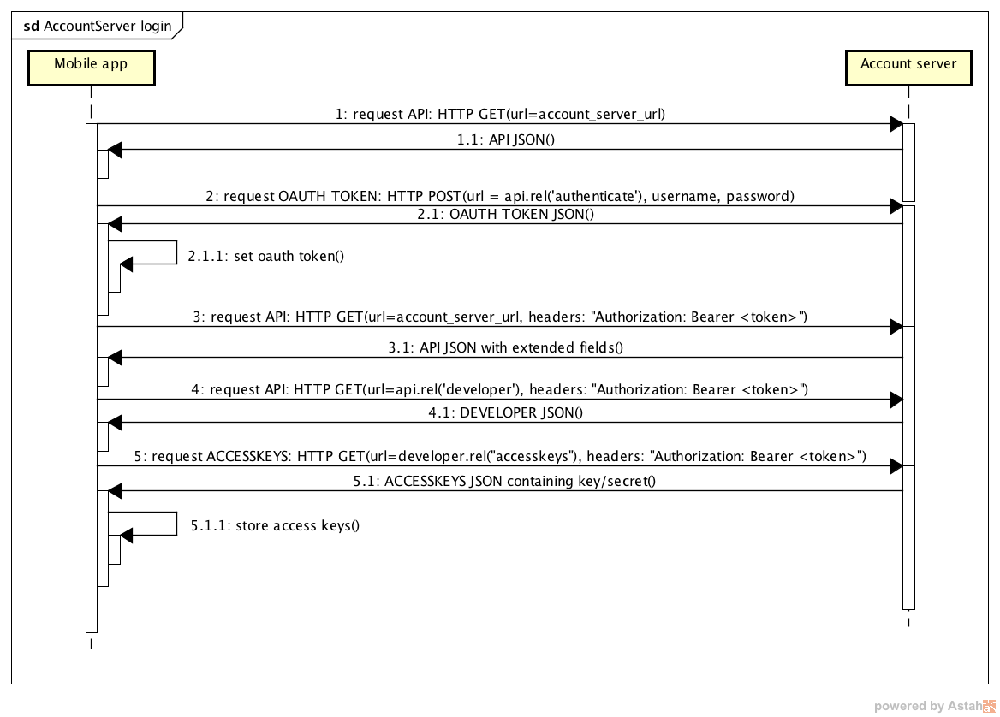

# Power switch

This project is a simple android application for controlling relay
through LWM2M protocol.
It is a complementary application to a 'relay-gateway' project
and it can be treated as a reference application for further development.

Similarly like in 'relay-gateway' project our target is 'relay device ' IPSO definition:

| Object Name       | Object ID      | Resource Name       | Resource ID |
| :----             | :--------------| :-------------------| :-----------|
| RelayDevice       | 3201           | DigitalOutputState  | 5550        |

## Prerequisites

Just import project to Android Studio, choose proper variant and you are
ready to go.

## About Application

As a reference application Power Switch covers 2 main use-cases:

* login to Account Server (AS)
* communication with Device Server (DS):
    + login
    + request clients
    + request relay device implementing simple pulling policy
    + changing relay device state

all in terms of the RESTful architecture with HATEOAS constraints.

### Requesting client key and secret
Communication with Device server requires user to be authenticated.
To acquire key and secret, that will be used to obtain DS access token, user
have to login first with his user and password.   

Following diagram shows logging procedure to a Account Server in details:

### Communication with Device Server

Having key and secret user can login to device server. Diagram below shows this procedure.

Next step is to request for clients matching application criteria (client name 'RelayDevice').

With 'Client' instance we can easily request for 'object types' matching IPSO id=3201 and
its resources.

Last thing is an interaction with specific device. To change 'relay' state user must perform PUT request 
with a new state of a device.

