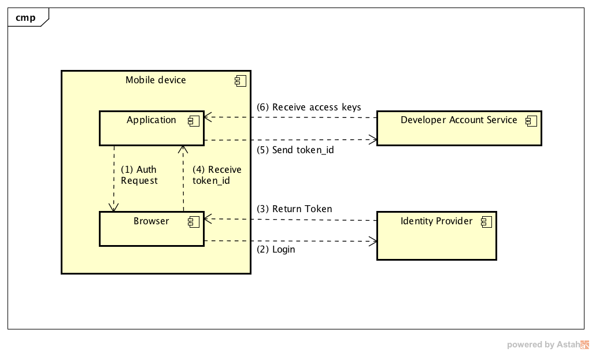
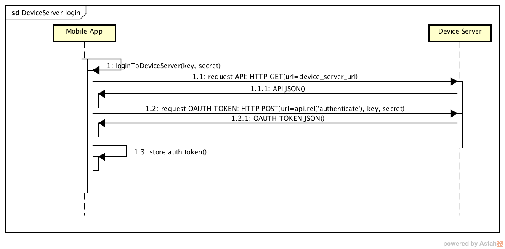
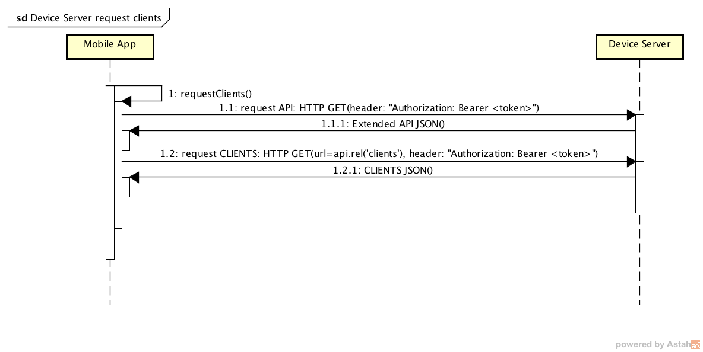
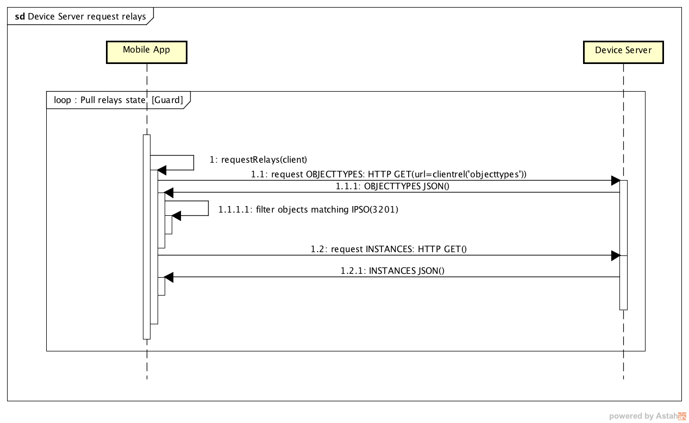
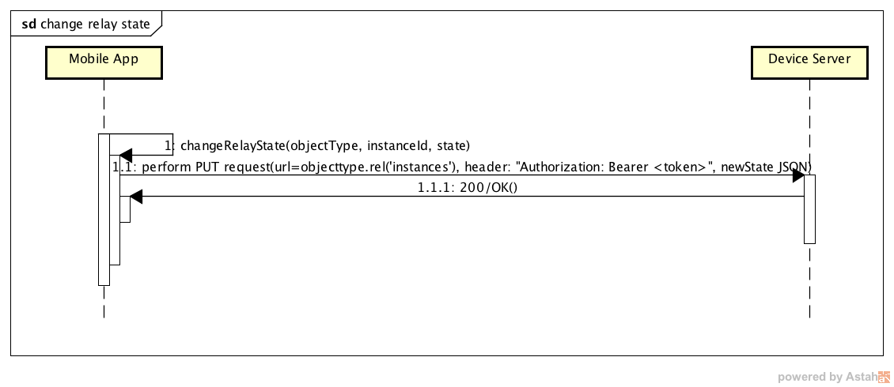

# Power switch

---
This project is a simple android application for controlling relay
through LWM2M protocol.
It is a complementary application to a 'relay-gateway' project
and it can be treated as a reference application for further development.

Similarly like in 'relay-gateway' project our target is 'relay device ' IPSO definition:

| Object Name       | Object ID      | Resource Name       | Resource ID |
| :----             | :--------------| :-------------------| :-----------|
| RelayDevice       | 3201           | DigitalOutputState  | 5550        |

## Prerequisites

Just import project to Android Studio, choose proper variant and you are
ready to go.

## About Application

As a reference application Power Switch covers 2 main use-cases:

* login to Developer Account Service (AS)
* communication with Device Server (DS):
    + login
    + request clients
    + request relay device implementing simple pulling policy
    + changing relay device state

all in terms of the RESTful architecture with HATEOAS constraints.

### Authentication

Communication with Device server requires user to be authenticated.
To acquire key and secret, that will be used to obtain DS access token, the user has to login first with their CreatorID (points (1)-(4) on the following diagram):



(1) launch system browser for signing into identity provider

##### Create authorization request:
```java
final String url = "https://id.creatordev.io/oauth2/auth";
final String client_id = "1c6c7bee-b5d0-440c-9b5a-61f54a62c18d";
final String scope = "core+openid+offline";
final Uri redirectUri = Uri.parse("io.creatordev.kit.powerswitch:/callback");
final String state = "dummy_state";
final String response_type = "id_token";

Uri uri = Uri.parse(url + "?" +
        "client_id=" + client_id + "&" +
        "scope=" + scope + "&" +
        "redirect_uri=" + redirectUri + "&" +
        "state=" + state + "&" +
        "nonce=" + nonce + "&" +
        "response_type=" + response_type);
```
Be sure to register your own client ID and redirectUri when developing your own apps (and the custom scheme registered in the AndroidManifest.xml).

##### Perform authorization request:

Having request uri prepared start system browser using following intent.
```java
Intent browserIntent = new Intent(Intent.ACTION_VIEW, uri;
browserIntent.setFlags(browserIntent.getFlags() | Intent.FLAG_ACTIVITY_NO_HISTORY);
context.startActivity(browserIntent);
```

(2) login/sign-up using system browser

(3) Identity Provider (IDP) issues an authorization code to the redirect URI

(4) application receives authorization intent with token_id

#### Registering authorization response intent
To receive the OAuth2 authorization response intent from system browser, the application must register proper intent-filter in AndroidManifest.xml.
```xml
<intent-filter>
    <category android:name="android.intent.category.BROWSABLE"/>
    <category android:name="android.intent.category.DEFAULT"/>
    <action android:name="android.intent.action.VIEW"/>
    <data android:scheme="io.creatordev.kit.powerswitch"/>
</intent-filter>
```

##### Processing the OAuth2 response
With registered custom scheme, OAuth2 provides an authorization response to MainActivity directly. The following code shows how to retrieve a token_id for further interaction:
```java
@Override
  protected void onNewIntent(Intent intent) {
    if (intent != null) {
      handleResponseIntent(intent);
    }
  }

  private void handleResponseIntent(Intent intent) {
    Uri uri = intent.getData();
    if (uri != null) {
      String token = uri.toString().split("#")[1].split("=")[1];
      ...
    }
  }
```

### Requesting access keys

Leaving authorization behind we can now perform a request that gives us access keys necessary to interact with device server.

To do that we have to perform POST request with token_id. Check previous diagram (points (5) and (6)).

### Communication with Device Server

Having key and secret user can login to device server. Diagram below shows this procedure.



Next step is to request for clients matching application criteria (client name 'RelayDevice').



With 'Client' instance we can easily request for 'object types' matching IPSO id=3201 and
its resources.



Last thing is an interaction with specific device. To change 'relay' state user must perform PUT request
with a new state of a device.


